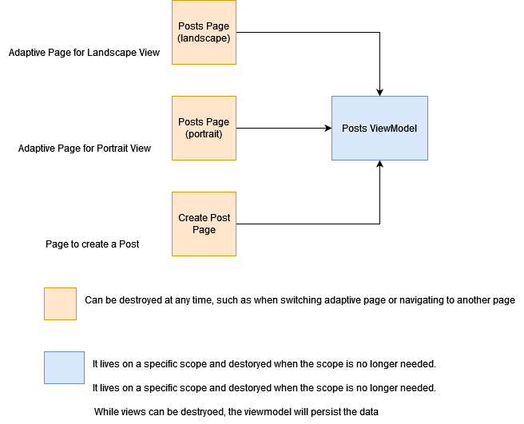

## View Models and Separating Business Logic from UI

In software development, a view model is an architectural pattern that separates the presentation layer (UI) from the business logic layer. The view model is responsible for preparing and managing data for the UI, while the business logic layer handles the underlying business logic of the application.

One of the main advantages of using a view model is that it helps to reduce the complexity of the UI layer. By separating the UI layer from the business logic layer, developers can create a more modular and maintainable code




## Getting Started

### Installation
````shell
npm i @xeinebiu/react-mvvm@1.1.0
````

### Creating View Models
Since we use typescript for safety, first we need to create the type for our view model.

````typescript
// posts.vm.ts

export type PostsViewModel = {
  posts: string[];

  loading: boolean;

  addPostLoading: boolean;

  createPostName: string;

  setCreatePostName(name: string): void;

  addPost(): void;
};
````

````typescript
// home.vm.ts

export type HomeViewModel = Readonly<{
    viewModelDescription: string;
    loading: boolean;
}>;
````

Above, we have only defined the type for the view model. However, using view models provides the flexibility to have multiple implementations as needed. For example, we might have a PostsViewModelApi implementation for production use, and a PostsViewModelMock implementation for testing purposes. This approach enables us to switch between different implementations without modifying the rest of the application, making it easier to maintain and update our codebase over time.

### Creating MVVM Type
Once we have defined our view models, the next step is to combine them into a single object. This enables us to retrieve the view models later on as needed.

````typescript
// vm.ts

export type ViewModelsType = {
    posts: PostsViewModel;

    home: HomeViewModel;
};

````

### Creating MVVM Provider (Scope)
View models can be provided at different scopes, which determine their lifecycle. By defining the appropriate scope for our view models, we can ensure that they are created and destroyed at the appropriate times, improving the performance and memory usage of our application.

````tsx
// app.tsx

export function App() {
  const viewModels = useMvvm<ViewModelsType>({
    posts: PostsViewModelImpl(),
    home: HomeViewModelImpl(),
  });

  return <MvvmProvider viewModels={viewModels}>App Content ...</MvvmProvider>;
}

````

### Retrieving View Models from Pages
````tsx
export const MvvmPostsPage: FC = () => {
    const { posts } = useViewModel<ViewModelsType>();

    return (
        <Flex direction="column">
            Content ...
        </Flex>
    );
};
````

### That's it
Please refer to the example provided above and let us know if you have any questions or suggestions. If anything is unclear or needs improvement, please feel free to raise an issue so that we can address it. I am here to help you create maintainable and high-quality code.
